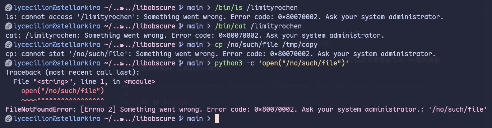

<!-- markdownlint-disable MD033 MD036 MD041 -->

<div align="center">


# 😨 libobscure 🤣

**「我修复了 Linux 的报错信息看得懂的 Bug」**

</div>

> [!WARNING]
> **该项目仅供以测试和娱乐为目的的使用。**
>
> 当前 `libobscure` 的实现面向 glibc/Linux，而非一个通用的错误处理兼容层。请勿将 `libobscure` 设置在 shell 的全局配置、systemd 环境或生产环境的 Linux 机器中，以免遇到无法诊断的问题。

---

## 📖 About

`libobscure` 是一个 Linux 上的 `LD_PRELOAD` 的整活项目。

`libobscure` 将常见的 `strerror`、`perror`、GNU `error()` 等错误文本替换为某 **现代商业操作系统** 风格的统一提示：

> Something went wrong. Error code: 0x8007xxxx. Ask your system administrator.

## ✨ Features

当前版本的 `libobscure` 覆盖了下面的错误接口：

- `perror`, `strerror` 和 GNU `strerror_r`
- `gai_strerror`
- GNU `error` 和 `error_at_line`

其中 `gai_strerror()` 的演示文本固定使用 `0x8007274D` 风格的网络错误码而忽略 ecode，以夸张还原某 **现代商业操作系统** 部分程序的行为（

## 👀 Preview



## 🚀 Build

在有 `gcc` 环境的 Linux 下操作。`git clone` 该 Repo 后编译：

```sh
gh repo clone LyCecilion/libobscure
cd libobscure
make
```

编译的产物位于 `./build/libobscure.so`。你可以通过 `file` 确认动态库类型：

```sh
file ./build/libobscure.so
```

```text
./build/libobscure.so: ELF 64-bit LSB shared object, x86-64, version 1 (SYSV), dynamically linked, not stripped
```

## 📝 Usage

将该 `.so` 文件加载到 `LD_PRELOAD` 中即可。

你可以对一次命令注入，不会修改当前 shell 的后续命令，如：

```sh
LD_PRELOAD="$PWD/build/libobscure.so" /bin/ls /rolling/wood
```

```text
ls: cannot access '/rolling/wood': Something went wrong. Error code: 0x80070002. Ask your system administrator.
```

这里的 `0x80070002` 来自 `0x80070000 | errno`，其中 `ENOENT` 的值为 `2`，还原了 Windows 侧错误代码的逻辑。

下面给出一些使用例。

### 文件操作

```sh
LD_PRELOAD="$PWD/build/libobscure.so" /bin/cat /rolling/wood
LD_PRELOAD="$PWD/build/libobscure.so" cp /no/such/file /tmp/copy
LD_PRELOAD="$PWD/build/libobscure.so" grep flag /no/such/ctf
```

这里洛汐使用了 `/bin/ls` 和 `/bin/cat` 以指定具体的 binary，因为在洛汐的 Fedora 上，洛汐将 `ls` 和 `cat` alias 到了 `eza` 和 `bat`，而后者有自己的错误处理逻辑。一般你无须添加 `/bin` 前缀。

这些操作仍然会以非零状态退出，使用 `echo $?` 可以查看原先的返回值。`libobscure` 不改变文件操作逻辑，仅替换了错误说明。这里，`errno` 到 `0x8007xxxx` 是 1:1 映射，不止 `ENOENT`。比如权限不足时：

```sh
LD_PRELOAD="$PWD/build/libobscure.so" /bin/cat /root/secret
```

```text
cat: /root/secret: Something went wrong. Error code: 0x8007000D. Ask your system administrator.
```

这里的 `0x8007000D` 对应 `EACCES`。

### Python 异常

```sh
LD_PRELOAD="$PWD/build/libobscure.so" python3 -c 'open("/no/such/file")'
```

```text
Traceback (most recent call last):
  File "<string>", line 1, in <module>
    open("/no/such/file")
    ~~~~^^^^^^^^^^^^^^^^^
FileNotFoundError: [Errno 2] Something went wrong. Error code: 0x80070002. Ask your system administrator.: '/no/such/file'
```

这会抛出 `FileNotFoundError` 异常，但原本的 `No such file or directory` 被替换为了 `Something went wrong ...`。异常类型和 errno 保留。

当然，你也可以直接调用

```bash
LD_PRELOAD="$PWD/build/libobscure.so" python3 -c 'import os; print(os.strerror(2))'
```

这会直接打印对应 errno 的 `strerror` 字符串值。可以看到，对于不同的 errno 值，只有 `Error code: 0x8007xxxx` 不同。

### 网络错误

DNS 解析失败走的是 `gai_strerror()`，它不读 `errno` 而是使用 `EAI_*` 错误码。`libobscure` 故意忽略 `ecode`，恒定返回 Windows Socket 的 `WSAECONNREFUSED`：

```sh
LD_PRELOAD="$PWD/build/libobscure.so" ping -c1 nonexistent.invalid
```

```text
ping: nonexistent.invalid: Something went wrong. Error code: 0x8007274D. Ask your system administrator.
```

`0x8007274D` 是 `WSAECONNREFUSED` 的 HRESULT 值，而非实际应返回的 `EAI_NONAME`。

Python 侧同样被覆盖：

```sh
python3 -c 'import socket; socket.getaddrinfo("nonexistent.invalid", 80)'
```

```text
socket.gaierror: [Errno -2] Something went wrong. Error code: 0x8007274D. Ask your system administrator.
```

### 注入到 Shell

务必不要在注入后的 Shell 执行任何重要操作。你可以通过

```sh
LD_PRELOAD="$PWD/build/libobscure.so" bash
```

注入整个 Shell，此 Shell 中启动的动态链接程序可能都会继承该注入。我们的演示视频中展示了这一点。演示结束后，退出该 Shell：

```sh
exit
```

若手动设置了环境变量，可以：

```sh
unset LD_PRELOAD
```

也可以在干净环境下检查原始行为：

```sh
env -u LD_PRELOAD ls /rolling_wood
```

## ❓ FAQ

目标平台是 glibc/Linux。不能确保 musl、BSD、macOS 上正常运行。不能确保静态链接程序正常运行。

出于安全原因，`libobscure` 不注入 setuid/setcap 程序；同时后者也会忽略 `LD_PRELOAD`。

GNU 与 POSIX 的 `strerror_r` 具有不同的 ABI。`libobscure` 实现的是 GNU 变体，不保证与其他 ABI 的兼容性。

## 🤔 `libobscure` 的原理

> **TL;DR:<br/>ELF 动态链接器具有符号抢占（symbol interposition）机制。`libobscure` 通过 `LD_PRELOAD` 加载，提供一组同名实现；使得程序遇到原来的错误时优先走 `libobscure` 的错误文本接口。`errno` 和退出状态由原程序决定。**

Linux 上的动态链接 ELF 程序在启动时由动态链接器加载。程序通常会声明自己需要的 `strerror` 等符号，但符号的具体地址要通过动态链接器从已加载的共享对象中解析。在 Shell 中设置 `LD_PRELOAD` 会要求动态链接器在程序的普通依赖加载之前加载 `libobscure.so`。由于 `libobscure.so` 中导出了与 glibc 同名的全局符号，程序对这些符号的引用就可能优先解析到 `libobscure.so`。因此，`libobscure` 不修改内核、syscall 或原 binary，也不替换 glibc。注入仅对于当前进程和继承该环境变量的动态链接子进程生效。

在编译中，我们使用了多个参数。`-shared` 使得生成可由动态链接器加载的共享对象而非普通的可执行文件；`-fPIC` 生成位置无关的代码，使得共享对象可以映射到不同虚拟地址。构建后，可以查看库导出的符号：

```sh
readelf -Ws ./build/libobscure.so | \
  grep -E ' (perror|strerror|strerror_r|gai_strerror|error|error_at_line)$'
```

`libobscure` 的所有普通错误文本由 `obscure_error()` 生成。对于常见的 Linux errno，`libobscure` 使用 `0x80070000 | errno` 得到 Windows `HRESULT_FROM_WIN32` 风格的错误值。需要说明，这里是编码形式的映射，而不严格是操作系统的语义转换。`HRESULT_FROM_WIN32` 的正式宏还包括对输入范围和非正数值的处理，`libobscure` 出于演示目的，并未采用。

`libobscure` 实现了 6 个拦截入口：

`strerror()` 是 glibc 的公开接口，`libobscure` 忽略了 glibc 的错误表，通过 `errnum` 生成一致的错误文本。但仅覆盖 `strerror()` 并不足以保证覆盖 glibc 的 `perror()`，例如部分 glibc 的内部实现使用的内部引用不一定参与普通的符号抢占，所以 `libobscure` 也覆盖了整个 `perror()`，读取当前的 `errno` 后进行前缀拼接。

`strerror_r` 存在两套不兼容的 ABI。源码定义了 `_GNU_SOURCE`，并实现了返回 `char *` 的 GNU 版本。

`getaddrinfo` 返回的 `EAI_*` 错误不使用普通 `errno` 文本，而由 `gai_strerror()` 转换。`libobscure` 因此额外覆盖了 `gai_strerror()` 并故意忽略 `ecode`，始终返回 `0x8007274D`，对应 Windows Socket 的 `WSAECONNREFUSED` HRESULT，以夸张还原某 **现代商业操作系统** 部分程序的行为（ ~~依旧爱 Microsoft TV~~

很多 GNU 工具不会调用 `perror()` 或 `strerror()` 这样的公开接口，而使用 GNU 的 `error()` 接口；`libobscure` 重新实现了这条完整路径，从而适配 `ls`, `cp`, `grep` 等程序。同样，我们也覆盖了 GNU `error_at_line`，这两种公开入口最终都进入 `obscure_verror()`：它刷新 `stdout`、补充程序名前缀、转发可变参数、保留退出语义，最终显示错误信息。

## 📄 License

[MIT LICENSE](./LICENSE). By Limity'roChen & LyCecilion, 2026.

## 🙏 Acknowledgments

洛汐 (Limity'roChen) 和零音 (LyCecilion) 完成了该项目的文档和视频剪辑。AI 完成了该项目的代码，并修改了文档中的部分表述。

<div align="center">

<picture>
  <source media="(prefers-color-scheme: dark)" srcset="./assets/chatgpt-white.png">
  
</picture>


GPT 5.6-sol & DeepSeek V4 Flash

> 还有，感谢以上两位主要开发者，绝大部分的（代码上的）贡献都是他们做的。

</div>

另外，感谢 [Project Hazelita 社群](https://qm.qq.com/q/3cbSKydvj2) 成员的帮助。

---

<div align="center">

🍀 | 🌌 | 🪼 | ❄️

</div>
